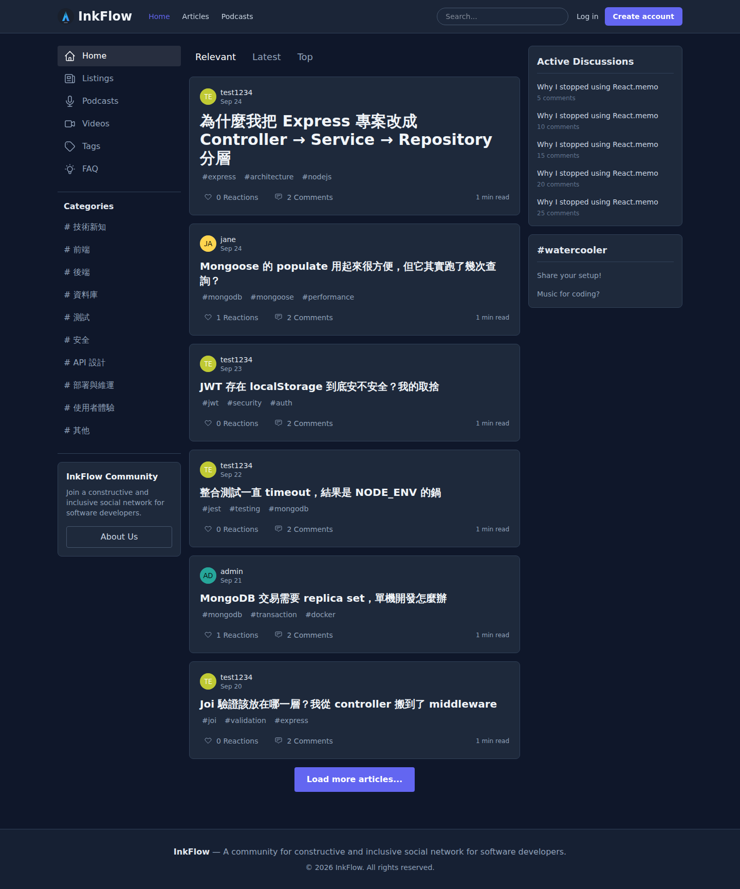
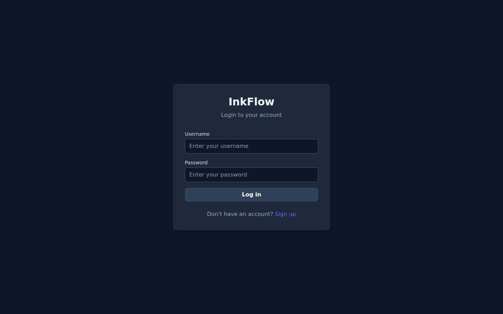
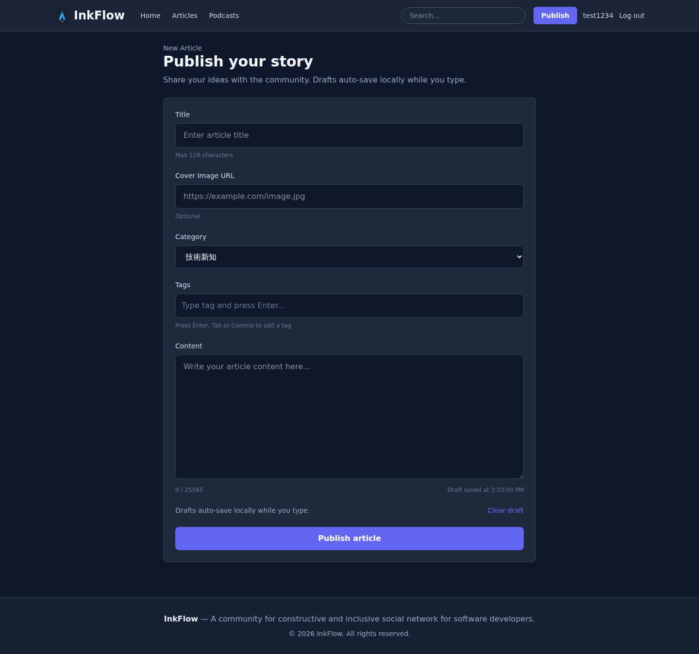
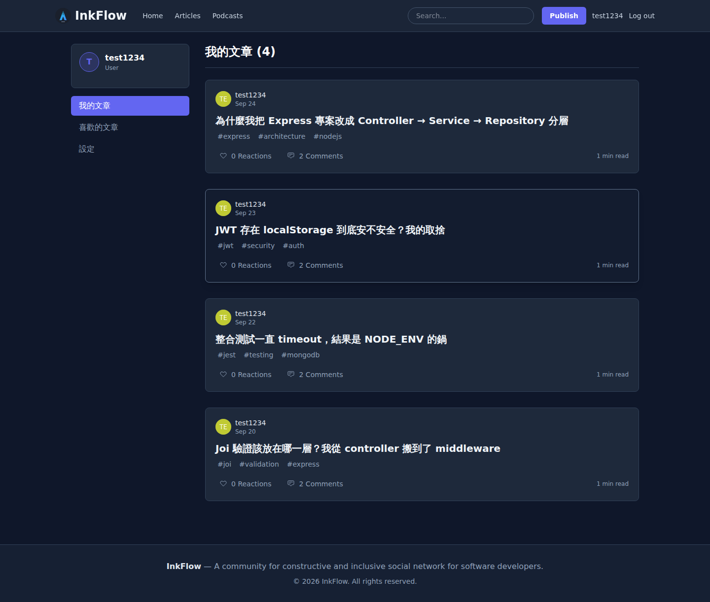
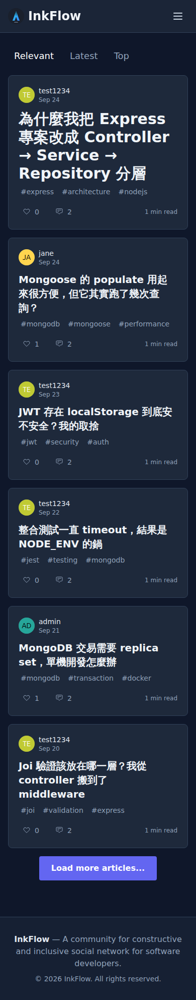
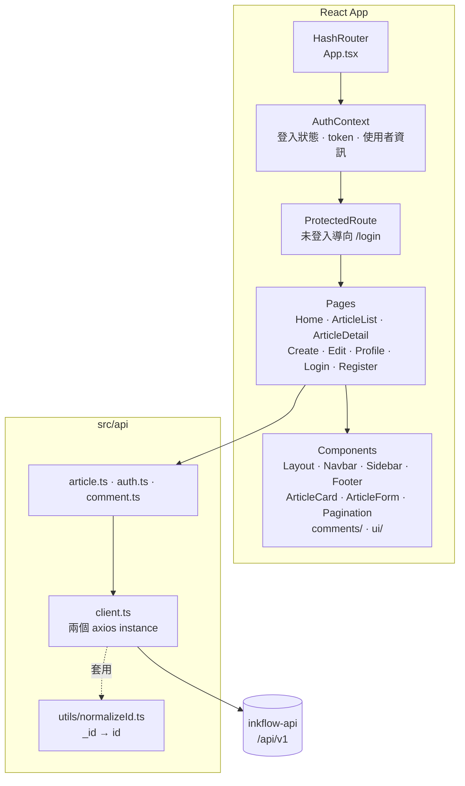

# InkFlow Web

InkFlow 的前端 — 一個部落格社群平台，使用 React 19 + TypeScript + Vite 開發，串接 [inkflow-api](https://github.com/cczzHoward/inkflow-api)。



---

## 目錄

- [功能](#功能)
- [畫面](#畫面)
- [技術棧](#技術棧)
- [架構](#架構)
- [快速開始](#快速開始)
- [部署](#部署)
- [實作筆記](#實作筆記)

---

## 功能

- **文章**：列表（搜尋／分類／分頁）、詳情、發表、編輯、刪除
- **評論**：對文章留言、刪除自己的留言
- **按讚**：對文章按讚與取消
- **帳號**：註冊、登入、變更密碼、個人頁（我的文章）
- **權限**：僅作者或管理員可編輯／刪除；未登入者以 `ProtectedRoute` 導向登入頁
- **響應式**：桌面三欄、行動裝置單欄 + 漢堡選單

---

## 畫面

| 首頁（文章列表） | 文章詳情與評論 |
| --- | --- |
|  |  |

| 登入 | 發表文章 |
| --- | --- |
|  |  |

| 個人頁 | 行動裝置 |
| --- | --- |
|  |  |

---

## 技術棧

| 類別 | 使用 |
| --- | --- |
| 框架 | React 19 |
| 語言 | TypeScript 5.8 |
| 建置工具 | Vite 7 |
| 樣式 | Tailwind CSS 4 |
| 路由 | React Router 7（`HashRouter`） |
| HTTP | Axios（含 request／response interceptor） |
| 狀態管理 | React Context + Hooks |
| 其他 | date-fns、jwt-decode |
| 檢查 | ESLint 9 + typescript-eslint |
| 部署 | GitHub Actions → GitHub Pages |

---

## 架構



### 目錄結構

```text
src/
├── main.tsx              # 進入點，掛上 HashRouter
├── App.tsx               # 路由定義 + ProtectedRoute
├── api/
│   ├── client.ts         # axios 設定、token 注入、401 處理
│   ├── article.ts        # 文章相關 API
│   ├── auth.ts           # 認證相關 API
│   ├── comment.ts        # 評論相關 API
│   └── utils/
│       └── normalizeId.ts  # 後端 _id 轉成前端慣用的 id
├── contexts/
│   └── AuthContext.tsx   # 登入狀態與使用者資訊
├── pages/                # 9 個頁面元件
├── components/
│   ├── Layout.tsx        # 共用版型（Navbar + Sidebar + Footer）
│   ├── comments/         # CommentForm · CommentList
│   └── ui/               # Alert · Input · Skeleton
├── types/                # API 與領域型別定義
└── styles/index.css      # Tailwind 進入點
```

---

## 快速開始

### 前置需求

需要先啟動後端 [inkflow-api](https://github.com/cczzHoward/inkflow-api)（預設在 `http://localhost:8080`）。

### 安裝與啟動

```bash
git clone git@github.com:cczzHoward/inkflow-web.git
cd inkflow-web
npm ci
```

建立 `.env.local` 指向後端：

```env
VITE_API_URL=http://localhost:8080/api/v1
```

> 未設定時會使用 `src/api/client.ts` 裡的預設值 `http://localhost:8080/api/v1`。

```bash
npm run dev       # 開發伺服器 → http://localhost:5173
npm run build     # 型別檢查 + 打包到 dist/
npm run preview   # 預覽打包結果
npm run lint      # ESLint
```

用後端 seeder 的預設帳號登入：`admin / admin123` 或 `test1234 / test1234`。

---

## 部署

推上 `master` 會觸發 [`deploy-pages.yml`](.github/workflows/deploy-pages.yml)，自動建置並發佈到 GitHub Pages。

後端位址由 repository secret `VITE_API_URL` 提供，在建置階段注入。

> **注意**：`vite.config.ts` 的 `base` 必須與 repository 名稱一致（目前為 `/inkflow-web/`）。GitHub Pages 的網址是 `https://<帳號>.github.io/<repo 名稱>/`，若 repo 改名卻沒同步改這裡，所有 JS/CSS 資源都會 404。

---

## 實作筆記

**為什麼用 HashRouter**
GitHub Pages 是純靜態託管，沒辦法設定「所有路徑都回傳 index.html」的 rewrite 規則。用 `BrowserRouter` 時，直接開啟 `/articles/123` 或重新整理都會拿到 404。`HashRouter` 把路由放在 `#` 後面，瀏覽器只會請求根路徑，代價是網址多一個 `#`。

**兩個 axios instance**
後端回傳的是 MongoDB 的 `_id`，前端習慣用 `id`。大部分端點需要轉換，但有些（例如登入只回 token）不需要。與其在每個呼叫端各自處理，不如建立 `apiClient` 與 `apiClientWithNormalizeId` 兩個 instance，差別只在 response interceptor 有沒有套 `normalizeId`。

**401 的統一處理**
`client.ts` 的 response interceptor 收到 401 就清掉 `localStorage` 的 `auth_token`。這代表後端必須小心區分「token 失效」與「參數錯誤」—— 例如變更密碼時舊密碼打錯，後端回的是 400 而非 401，否則使用者打錯一次就會被登出。

**Token 存在 localStorage 的取捨**
`httpOnly` cookie 能擋 XSS 竊取，但會引入 CSRF，且前後端分開部署時跨網域 cookie 設定麻煩。這個專案是純前後端分離、後端無狀態、沒有第三方腳本，因此選擇 localStorage 並在 interceptor 統一處理失效。

---

## 待辦

- [ ] 導入 Vitest + React Testing Library（目前前端尚無自動化測試）
- [ ] Sidebar 的「Active Discussions」目前是靜態假資料，待接上真實 API
- [ ] 文章內容支援 Markdown 渲染
